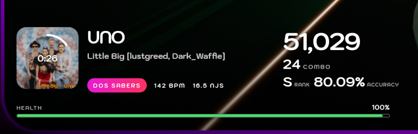
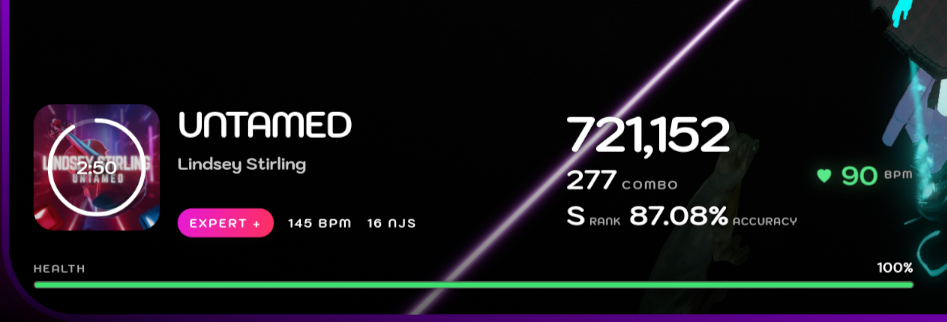

# BS Stream Overlay

**Launch the overlay:** [https://bs-overlay.thetimevortex.net](https://bs-overlay.thetimevortex.net)

BS Stream Overlay is an open-source, customizable Beat Saber browser overlay powered by [DataPuller](https://github.com/WentTheFox/BSDataPuller). It can display live song and performance information, including cover art, song title, difficulty, BPM, NJS, BSR code, score, combo, rank, accuracy, misses, and health. An optional heart-rate readout can use [HRCounter](https://github.com/qe201020335/HRCounter) and appear with the song overlay or as a separately positioned element.

## Preview

### Song and performance details

### Optional standalone heart rate

## Optional heart rate

Heart-rate support is completely optional and is disabled by default. Enable **Show heart rate** in the settings panel to read live BPM data from [HRCounter](https://github.com/qe201020335/HRCounter). You can display it in either of two ways:

- **With song overlay** attaches the heart icon and current heart rate to the main song and performance panel.
- **On its own** separates the heart-rate readout from the song panel and lets you place it in the top-left, top-right, bottom-left, or bottom-right corner.

The heart icon pulses at the reported rate and changes color as your heart rate rises:

- **120 BPM or lower:** green (`#58e88a`)
- **121–149 BPM:** gradually changes from green to yellow
- **150 BPM:** yellow (`#ffd34d`)
- **151–179 BPM:** gradually changes from yellow to red
- **180 BPM or higher:** red (`#ff4860`)

To use this feature, install HRCounter, enable its HTTP server, and enter its port in the overlay settings. The default HRCounter port is `65302`. The generated overlay URL saves whether heart rate is enabled, its display mode, port, and standalone position.

## Requirements

- DataPuller installed in Beat Saber
- HRCounter installed and its HTTP server enabled (optional, for heart rate)
- Streaming software that supports browser sources, such as OBS Studio, Streamlabs Desktop, Meld Studio, or similar software

## Font selection compatibility

Selecting from locally installed system fonts requires a Chromium-based browser, such as Google Chrome, Microsoft Edge, Brave, or Opera/OperaGX.

## Create your overlay

1. Install [DataPuller](https://github.com/WentTheFox/BSDataPuller) in Beat Saber.
2. Start Beat Saber and make sure DataPuller is running.
3. Open [bs-overlay.thetimevortex.net](https://bs-overlay.thetimevortex.net).
4. Use the settings panel to choose the overlay position and the information you want to display.
5. Optional: enable **Show heart rate**, then choose **With song overlay** or **On its own** and configure HRCounter's port.
6. Select **Copy overlay URL** at the top of the page.
7. Add a browser source in OBS, Streamlabs, Meld, or another supported streaming application.
8. Paste the copied URL into the browser source.

Your selected settings are stored in the generated URL, so the browser source will use the same layout, scale, accent color, corner shadow, and visible fields. To edit an existing overlay, select **Load settings** on the settings page and paste its URL.
